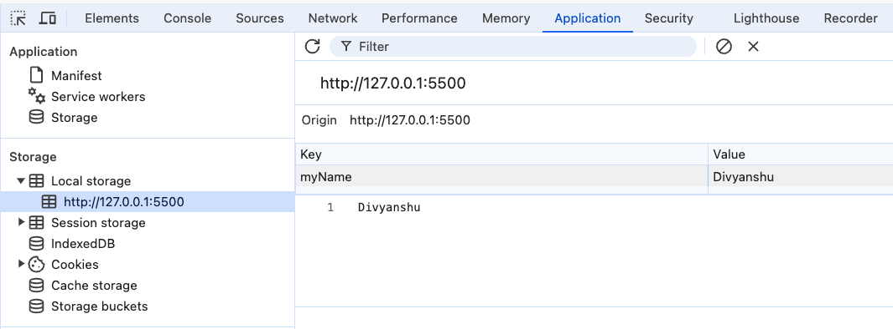

# Commit 1: [ index.html && index.js ]

- Populating the html tag <span> using the localStorage.
  - But in the code we have not populated the localStorage. this is becoz we have done this using the Inspect tool using the localStorage section in the application [as shown below]

<div style="text-align: center">

</div>

---

# Commit 2: [ Code2]

- Accessing the input tag value and storing it in the localStorage
- then using localStorage we are setting the value of input tag

# Commit 3: [ Code 3]

- we have created the 2 input tag -> for name and age.
- In js file we have used Line `8 & 11` as same similarly Line `15 & 18`
  - Lines 8 and 15 fetch the values stored in Local Storage for myName and myAge, respectively, and display them on the UI. This ensures that when the index3.html file is loaded, any previously stored values are shown.

### Updating Local Storage and UI:

- Lines 11 and 18 set up event listeners for the input fields.
- When the user types in the name input field, the input event triggers, and the following happens:
- The new value is saved to Local Storage using localStorage.setItem('myName', event.target.value).
- The displayed name on the UI is updated to reflect this change using nameElement.innerText = localStorage.getItem('myName').
- Similarly, for the age input field, when the user types, the value is updated in Local Storage and reflected on the UI.

# Commit 4: changing the type of input tag in the code 3:

- since age is number so we have changed the type of age tag [ input ] to number
- index3.html [folder:Code3]

```html
<input class="number" type="text" placeholder="Enter your age" />
```

# Commit 5: Saving the Object in the local storage [ index5.html file in Code 4 folder]

- code in the file `[ index5.html ]` in the `Code4` folder

# Commit 6: Application of saving the Object in the local storage -> using input field
